<div align="center">

# SILENT SOLUTION

**You never see the ocean. Only the instruments.**

A Cold War submarine sonar and fire-control simulator: a hunt played through a passive waterfall, an acoustic profiler,
a torpedo data computer, brass gauges and a chattering teleprinter. The periscope will show you the sea,
but while the mast is up, the sea can see you too.

[](https://www.python.org/)
[](https://pyga.me/)
[](https://numpy.org/)
[](https://docs.astral.sh/uv/)


[](LICENSE)
[](https://github.com/JFrusher/SilentSolution/actions/workflows/checks.yml)

[Quick start](#-quick-start) · [The station](#-the-station) · [How an attack works](#-how-an-attack-works) ·
[Game modes](#-game-modes) · [Replay](#-after-action-replay) · [Controls](#-controls) · [Under the hood](#-under-the-hood) ·
[Development](#-development)

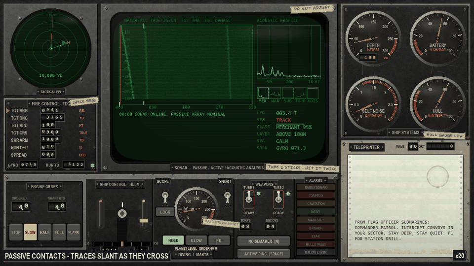

<sub>A whole attack in fifteen seconds: hear her, lock on, range her, solve, fire a spread, steer it home. Real game, scripted run, time-lapsed where it says so.</sub>

</div>

---

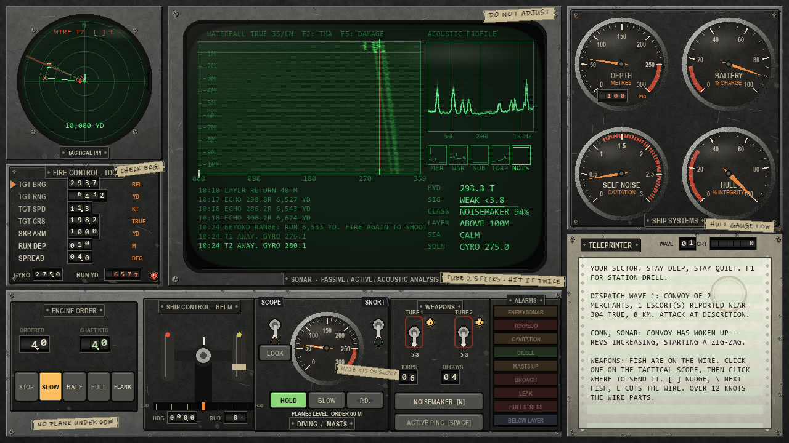

## ✦ What it is

Silent Solution puts you at the attack console of a diesel-electric submarine, somewhere between the last war and
the next one. Convoys cross your patrol area under an escort screen. To sink them you have to do what real
fire-control parties did: **hear** a contact, **classify** it from its spectrum, **build a solution** from
bearings over time, then **fire and steer** the fish in, all without being heard, pinged, or seen.

It is a simulation first. Under the console there is a real world model: ships with momentum, a thermocline that
bends sound, weather that drowns weak contacts, escort captains who back-plot your torpedo track, and lookouts who
roll dice every second your periscope is up. **You only ever see that world through your sensors.**

> [!NOTE]
> Every sound and every image in the game is generated at runtime with NumPy and pygame: sonar pings, the hull
> creaking, the hammertone paint, the CRT phosphor, the sea through the periscope. The repository has **no asset
> files**.

|  |  |
|---|---|
| 🎧 **Passive and active sonar.** A scrolling waterfall, a trainable hydrophone dial, an acoustic profiler with a signature library, and pings whose echo delay gives range (and gives you away). | 🎯 **Torpedo data computer.** A position keeper that runs the target forward, an intercept solver, salvo spreads, and wire-guided fish you steer on the tactical scope. |
| 📈 **Target motion analysis.** A bearings-vs-time plot with a vectorised least-squares solver: 34,776 course, speed and range hypotheses scored every time you ask. | 🔭 **A periscope that can betray you.** A full-screen eyepiece with hull-down horizons, wakes, weather and lens effects, plus an exposure meter that uses the same maths as the enemy lookouts. |
| 🚢 **Ships with intent.** Merchants cruise, alarm, zig-zag and scatter. Escorts patrol, search, hunt, attack and evade. Enemy submarines stalk you and shoot back. | 🛠️ **Damage control.** Hits knock out planes, motors, hydrophones and tubes. One repair party works down a list that you put in order. |
| 🎖️ **A campaign.** Six patrols with briefings and objectives, a debrief after each, seven ranks, refits, a career save and a high-score table. | ♿ **Accessible by design.** Every audio cue also has a lamp, a log line or a picture. Keys can be rebound. Large text and colour-blind lamps are available. |
| 🗺️ **After-action replay.** Every patrol recorded and replayed in 2.5D on a plotting table you can orbit, scrub and step event by event: the whole truth, depth included. | 📐 **One 3D backbone.** Every bearing, range and depth on every display comes from one geometry core, cross-checked by tests through a turn. |

## ⚡ Quick start

```bash
git clone https://github.com/JFrusher/SilentSolution.git
cd SilentSolution
uv run main.py
```

[uv](https://docs.astral.sh/uv/) installs Python 3.11+ and the two dependencies (`pygame-ce`, `numpy`) on first run.

> [!TIP]
> New? Press <kbd>T</kbd> on the title screen. **Training** has four chapters that walk you through every station
> with a live merchant, an escort attack and an incoming torpedo. In game, <kbd>F1</kbd> shows the key card and
> <kbd>F6</kbd> skips a drill.

<details>
<summary><b>Windows: build a single-file .exe</b></summary>

```bash
uv run --with pyinstaller build.py      # -> dist/SilentSolution.exe  (one file, no console window)
```

The executable needs no Python install. If it ever crashes, the traceback is appended to
`~/.silent_solution/crash.log`.
</details>

## 🎛 The station

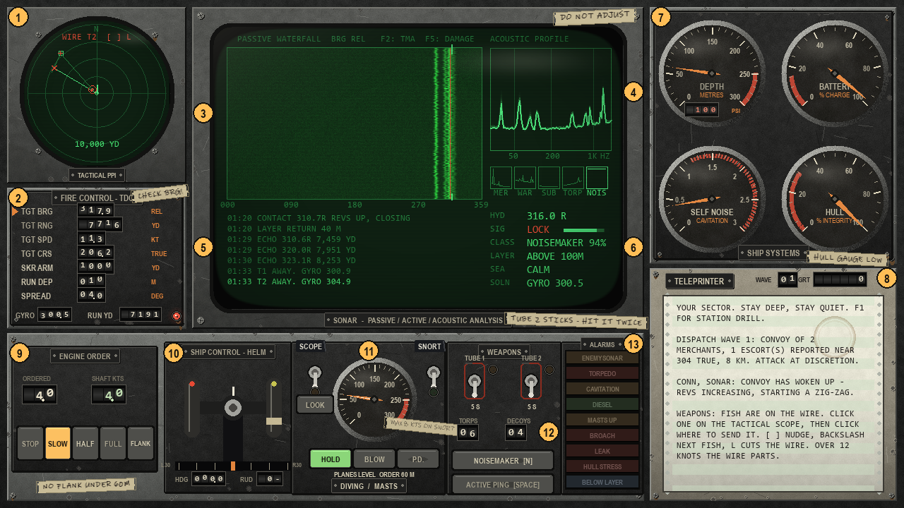

| # | Instrument | What it tells you |
|:-:|---|---|
| 1 | **Tactical PPI** | Own ship at the centre. Echo fixes, enemy ping lines, your torpedoes, and the wire's aim point. Click a wired fish, then click the water to steer it. |
| 2 | **Fire control (TDC)** | Target bearing, range, speed and course; seeker arm distance, run depth and salvo spread. Mechanical drum counters show the gyro angle and the run. The lamp lights when there is a valid solution. |
| 3 | **Passive waterfall** | Bearing across, time down, north-stabilised by default (<kbd>F7</kbd> for ship's head), 1 s a line (<kbd>F8</kbd> for 0.1 / 1 / 3 s). A contact's trace slants and curves with its real bearing drift and holds still through your own turns. The red line is your hydrophone dial; the bright ticks show where the TDC thinks the target is. |
| 4 | **Acoustic profile** | The spectrum of whatever the dial hears, matched live against the signature library: merchant, warship, submarine, torpedo, noisemaker. |
| 5 | **Sonar log** | Timestamped contacts, echoes, launches and detonations. |
| 6 | **Readouts** | Dial bearing, signal strength, classification confidence, the layer, the sea state, and the gyro solution. |
| 7 | **Ship systems** | Depth (crush depth in red), battery (or O₂ on Iron Captain), self-noise and cavitation, hull integrity. |
| 8 | **Teleprinter** | Orders from Flag, contact reports and damage-control traffic, typed at 34 characters a second with a clack per key. |
| 9 | **Engine order telegraph** | STOP · SLOW · HALF · FULL · FLANK, with ordered and shaft speeds. Fast is loud. |
| 10 | **Helm** | Rudder yoke and heading. |
| 11 | **Diving and masts** | Depth-order dial, hold, emergency blow, periscope depth; scope and snorkel switches. |
| 12 | **Weapons** | Guarded tube switches, reload timers, racks and decoys, noisemaker, active ping. |
| 13 | **Alarms** | Annunciator tiles with the legend engraved on each lens, so colour is never the only cue. |

<table>
  <tr>
    <td width="50%">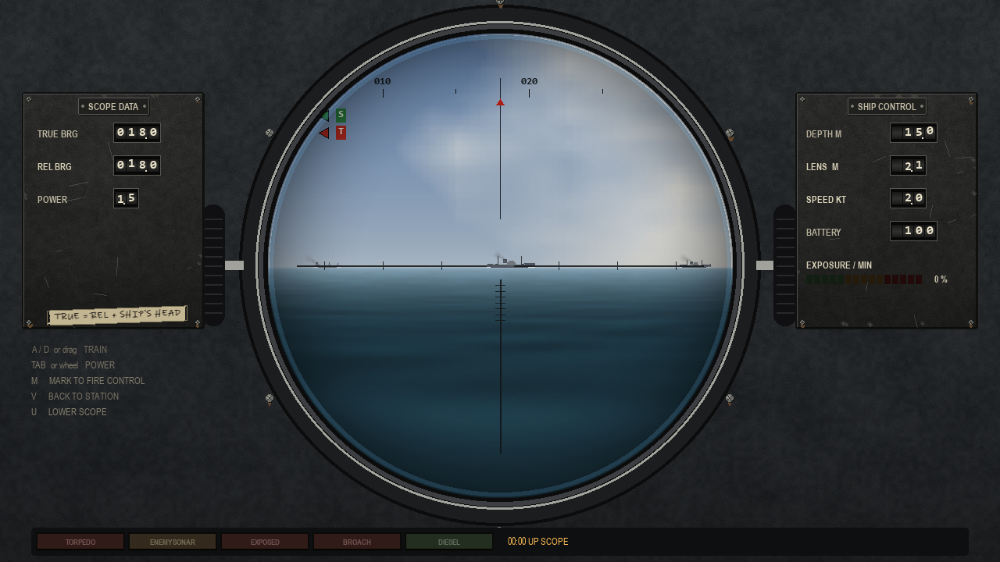<br><sub><b>Low power, 1.5x.</b> A convoy hull-down on the horizon; the sea, the sky and the haze follow the weather.</sub></td>
    <td width="50%">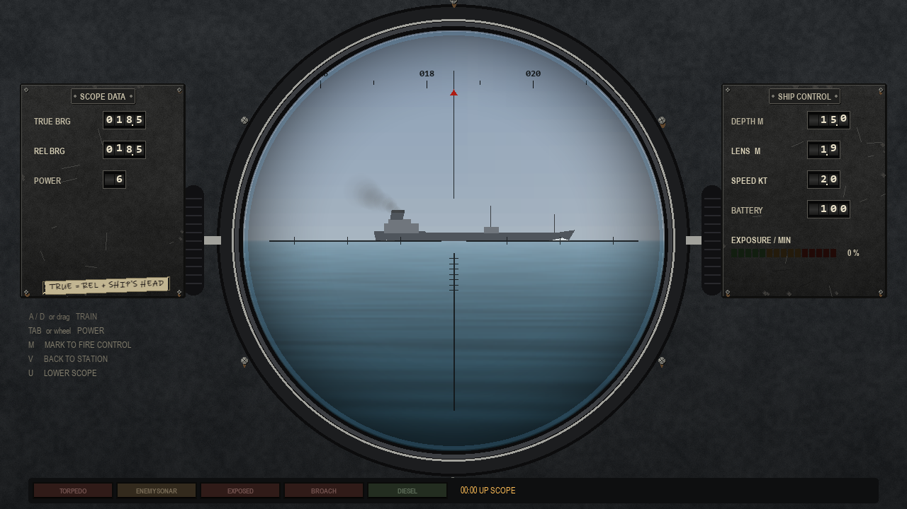<br><sub><b>High power, 6x.</b> Put her in the wires and press <kbd>M</kbd>: the stadimeter mark sends bearing <i>and</i> range to the TDC.</sub></td>
  </tr>
  <tr>
    <td width="50%">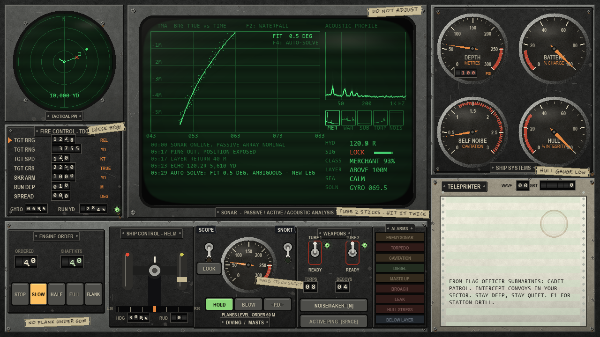<br><sub><b>TMA plot (<kbd>F2</kbd>).</b> Every bearing you hold is a dot; the curve is what the TDC's estimate implies. Two legs and a ping pin it down.</sub></td>
    <td width="50%">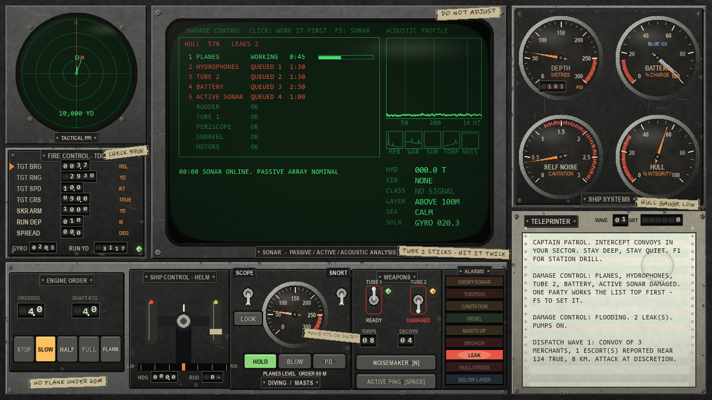<br><sub><b>Damage board (<kbd>F5</kbd>).</b> One party, one job at a time. Click a line to send them there first; jammed planes before a cracked battery.</sub></td>
  </tr>
  <tr>
    <td width="50%">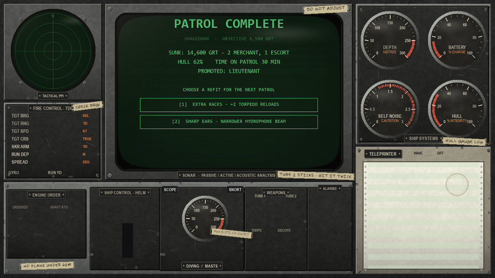<br><sub><b>Debrief.</b> Tonnage against the objective, promotion, and a choice of two refits for the next patrol.</sub></td>
    <td width="50%">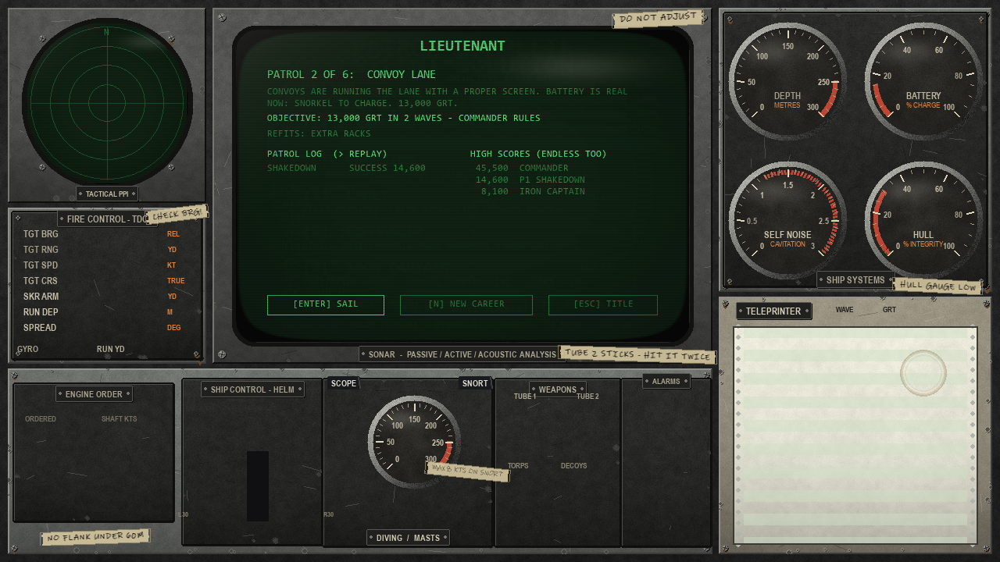<br><sub><b>Career.</b> The next briefing, refits fitted, the patrol log and the high-score table (endless runs included).</sub></td>
  </tr>
</table>

## 🎯 How an attack works

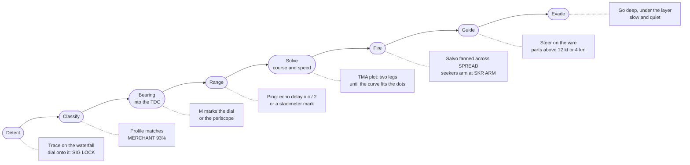

1. **Listen.** A contact is a bright trace, slanting as its bearing drifts. Train the dial by the `SIG < 3.2`
   guide until it reads `LOCK` (on the trace, within 1.5° on Commander); from then on the dial **tracks** it on
   its own, and the bearing logs to the TMA plot every four seconds.
2. **Classify.** The profiler compares the spectrum with its library. Merchants show low shaft lines. Warships
   whine high. A submarine is one faint line. A torpedo is a sharp spike. A noisemaker is a flat wall.
3. **Mark and range.** <kbd>M</kbd> sends the bearing to the TDC. <kbd>Space</kbd> pings, and the echo delay gives
   range, but every escort in earshot now knows where you are. The quiet alternative is a periscope stadimeter mark.
4. **Solve.** Set target speed and course until the TDC's curve runs through your bearing dots. Bearings from one
   leg are ambiguous, so change course and get a second leg.
5. **Fire.** <kbd>F</kbd> fires a salvo from every ready tube, fanned across `SPREAD`. The solver leads the target by
   $`\sin\lambda = \tfrac{v_t}{v_{torp}}\sin\theta`$.
6. **Guide, then go.** Fish run on the wire, so you can steer them with clicks on the scope. Then get under the layer,
   ring down to SLOW, and let the escort's pattern land where you used to be.

<p align="center">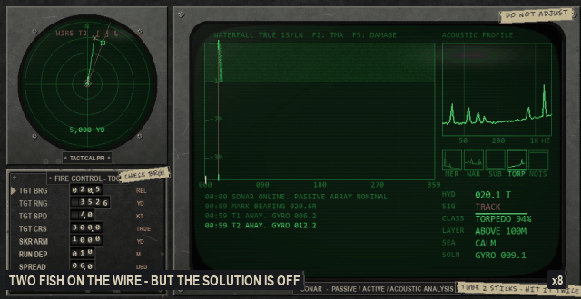<br>
<sub><b>On the wire.</b> A poor solution, rescued: click the fish, click where to send it, and the seeker does the rest.</sub></p>

## 🎮 Game modes

<p align="center">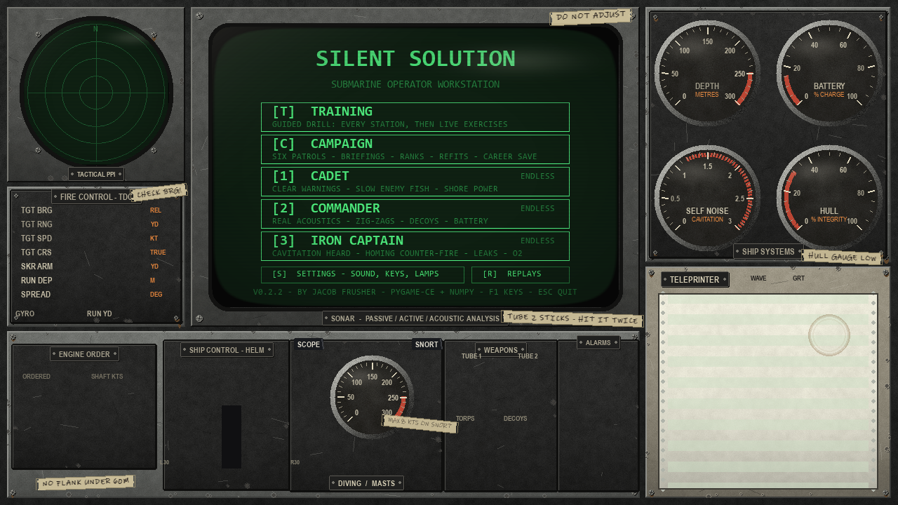</p>

<table>
<tr><th>Mode</th><th>What you get</th></tr>
<tr><td><b>Training</b> <kbd>T</kbd></td><td>Four chapters, each of which can be started on its own: <b>Station drill</b> · <b>Sonar and fire control</b> · <b>The periscope</b> · <b>Live exercises</b> (weather, escort attack, damage control, torpedo evasion, sub hunt). Training warheads leave you shaken, never sunk.</td></tr>
<tr><td><b>Campaign</b> <kbd>C</kbd></td><td>Six patrols, from <i>Shakedown</i> to <i>Last Patrol</i>, with briefings, tonnage objectives (plus a submarine or an escort to sink on some), harder rules and worse weather as you go. Return to base with <kbd>Enter</kbd> once the objectives are met. Rise from Sub-Lieutenant to Rear Admiral and pick refits along the way.</td></tr>
<tr><td><b>Endless</b> <kbd>1</kbd> <kbd>2</kbd> <kbd>3</kbd></td><td>Wave after wave of convoys, each harder than the last, with a resupply from the tender between waves. Your best runs go on the high-score table.</td></tr>
</table>

<details>
<summary><b>Campaign patrols</b></summary>

| # | Patrol | Rules | Waves | Objective | Notes |
|:-:|---|---|:-:|---|---|
| 1 | Shakedown | Cadet | 2 | 6,500 GRT | One escort, quiet lane |
| 2 | Convoy Lane | Commander | 2 | 13,000 GRT | The battery is real: snorkel to charge |
| 3 | The Narrows | Commander | 3 | 19,500 GRT | Foul weather; rain masks contacts, and you |
| 4 | Wolf in the Fold | Commander | 3 | 6,500 GRT + a submarine | A hostile boat is shadowing the convoys |
| 5 | Heavy Screen | Iron Captain | 3 | 20,000 GRT | Sharp lookouts, homing counter-fire, oxygen |
| 6 | Last Patrol | Iron Captain | 4 | 32,500 GRT + an escort | The big convoy, in a gale |

**Refits:** quiet screws (self-noise −20%) · extra racks (+2 torpedoes) · more decoys (+2) · fast reload (−30%) ·
sharp ears (narrower beam) · thick hull (damage −25%).
</details>

<details>
<summary><b>Difficulty presets</b></summary>

|  | Cadet | Commander | Iron Captain |
|---|:-:|:-:|:-:|
| Enemy torpedo | 28 kt, straight runner | 40 kt, 600 yd seeker | 45 kt, 1,200 yd seeker |
| Tube reload | 30 s | 45 s | 60 s |
| Battery / oxygen | shore power | battery | battery + O₂ |
| Hydrophone beam | 3.0° (forgiving) | 1.5° | 1.5° |
| Thermocline | leaks 30% | leaks 30% | hides contacts completely |
| Warnings and auto-solve | ✔ | | |
| Convoys zig-zag | | ✔ | ✔ |
| Enemy sub decoys | 0 | 2 | 3 |
| Cavitation heard instantly | | | ✔ |
| Flooding leaks | | | ✔ |
| Lookouts | ×0.5 | ×1.0 | ×1.5 |
| Scope bends at speed | | | ✔ |
</details>

## 🗺 After-action replay

Every patrol is recorded, whatever the mode and however it ends, and the last ten are kept. Open one with
<kbd>A</kbd> on the debrief or the game-over box, from **Replays** on the title screen (<kbd>R</kbd>), or by clicking
a line in the career log. The engagement plays back on a plotting table in the world's own truth: every hull, fish
and depth charge where it really was, including the ones you never saw.

<p align="center">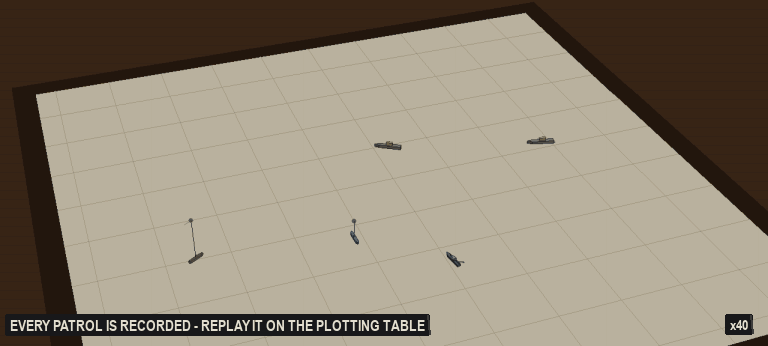<br>
<sub><b>The plotting table.</b> A convoy attack replayed: the fish run out, the escort hunts back, and a side view finds the boat that waited under the layer.</sub></p>

Submerged boats hang on stalks below their shadows on the chart, under a smoked-glass sheet at the layer depth,
fading toward the sea colour as they go deeper. The timeline is ticked at every launch, hit and pattern.

| Mouse | | Keys | |
|---|---|---|---|
| drag | orbit | <kbd>Space</kbd> · <kbd>+</kbd> <kbd>-</kbd> | play / pause · speed x1 / x4 / x16 / x60 |
| right-drag | pan | <kbd>←</kbd> <kbd>→</kbd> · with <kbd>Shift</kbd> | 10 s back / on · event to event |
| wheel | zoom | <kbd>1</kbd> <kbd>2</kbd> <kbd>3</kbd> · <kbd>4</kbd> · <kbd>0</kbd> | plan / side / oblique · follow own boat · reset |
| click the timeline | scrub | <kbd>[</kbd> <kbd>]</kbd> · <kbd>Home</kbd> | depth exaggeration x1 to x25 · back to the start |
| hover a model | depth, speed, course | <kbd>Esc</kbd> | back |

Replays are gzipped JSON in `~/.silent_solution/replays`, sampled once a second (about 0.1 MB for a half-hour
patrol). The recorder only reads the world, so recording never changes how a patrol plays out.

## ⌨ Controls

Everything works with the mouse (click, drag, wheel) or the keyboard. Every key below can be rebound in
**Settings** (<kbd>S</kbd> on the title screen), alongside volume per category, mouse sensitivity, large text and
colour-blind lamps.

<details open>
<summary><b>Key card</b></summary>

| Sonar and fire control | | Ship handling | |
|---|---|---|---|
| <kbd>A</kbd> <kbd>D</kbd> | train the dial (or the scope) | <kbd>Z</kbd> <kbd>X</kbd> | engine order down / up |
| <kbd>M</kbd> | mark bearing (stadimeter at the scope) | <kbd>←</kbd> <kbd>→</kbd> · <kbd>C</kbd> | rudder · amidships |
| <kbd>Space</kbd> | active ping | <kbd>Q</kbd> <kbd>E</kbd> | order 10 m shallower / deeper |
| <kbd>W</kbd> <kbd>S</kbd> · <kbd>↑</kbd> <kbd>↓</kbd> | pick TDC row · adjust (hold to run) | <kbd>H</kbd> · <kbd>B</kbd> | hold depth · emergency blow |
| <kbd>F</kbd> · <kbd>1</kbd> <kbd>2</kbd> | fire salvo · fire one tube | <kbd>G</kbd> | periscope depth |
| <kbd>[</kbd> <kbd>]</kbd> · <kbd>\\</kbd> · <kbd>L</kbd> | nudge wired fish · next fish · cut wire | <kbd>U</kbd> · <kbd>K</kbd> | raise scope · raise snorkel |
| <kbd>N</kbd> | noisemaker | <kbd>V</kbd> · <kbd>Tab</kbd> | look through scope · power 1.5x / 6x |
| <kbd>T</kbd> | scope range 5k / 10k / 20k yd | <kbd>F2</kbd> · <kbd>F5</kbd> | TMA plot · damage board |
| <kbd>F7</kbd> · <kbd>F8</kbd> | true / ship's-head bearings · waterfall time scale | <kbd>O</kbd> | swing the periscope onto the sonar bearing |
| <kbd>F4</kbd> | auto-solve (Cadet and Training) | <kbd>P</kbd> · <kbd>F1</kbd> · <kbd>Esc</kbd> | pause · key card · quit / back |
</details>

<details>
<summary><b>Settings page</b></summary>

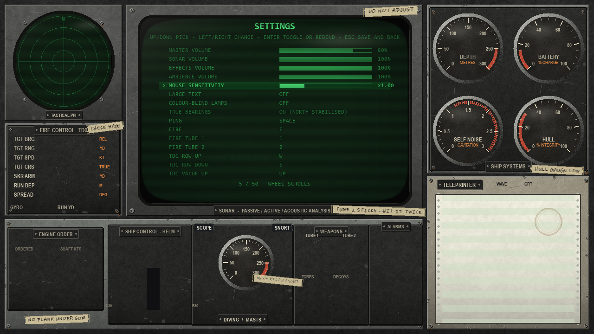

Saved to `~/.silent_solution/settings.json`. If a key you choose is already in use, the two bindings swap.
<kbd>Esc</kbd>, <kbd>F1</kbd> and <kbd>P</kbd> are reserved.
</details>

## 🔬 Under the hood

About 6,000 lines of Python in two halves that never mix: a **world** that holds the truth, and an **operator** side
that only ever sees it through sensors. Every bearing, range and angle between two bodies (true and relative
bearing, horizontal and slant range, depression angle, bearing rate, range rate, target angle) comes from one 3D
**geometry core**, `geometry.py`, and `test_geometry.py` cross-checks every sensor and display against it on
random 3D scenarios through hard turns.

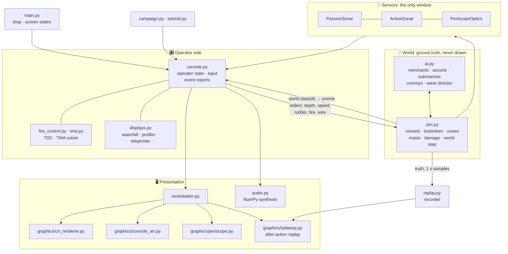

<details>
<summary><b>🌊 World model</b>: kinematics, ocean, weather, spotting</summary>

- **Everything moves on `dt`.** Ships accelerate, turn at finite rates and carry way. The planesman dives at
  1.5 m/s, a blow at 5 m/s, and steerage falls off below 4 kt.
- **Thermocline at 100 m.** Sound crossing the layer loses most of its energy (`layer_loss`): a contact on the other
  side is quieter, its echo is in the shadow, and the layer itself returns reverb.
- **Weather fronts** roll in over about 20 s. Rain raises the noise floor on the waterfall and the profile, the
  wind builds the sea over a minute, and the sea state feeds the periscope picture, spotting and snorkel flooding.

  <p align="center">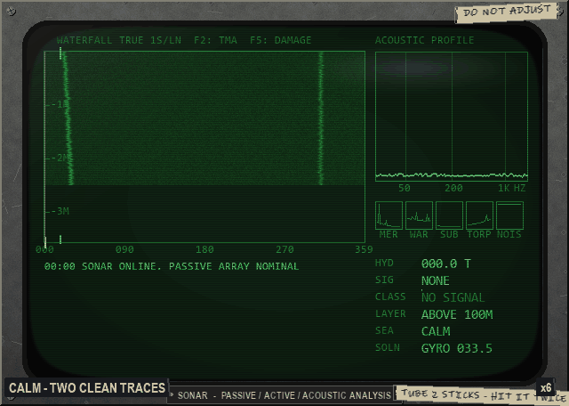<br>
  <sub><b>Weather is a sensor problem.</b> Rain drowns the traces; a heavy sea breaks over the lens; your own diesels fog the waterfall.</sub></p>

- **Masts are physical.** The scope head clears the water by `SCOPE_TOP − z − wave`, measured against the live
  swell at the boat's position. Waves slam the snorkel head valve. Speed throws a feather, floods the snorkel,
  and on Iron Captain bends the scope.
- **Being seen is one shared formula.** The enemy lookouts and your own exposure meter use it alike:

$$
p_{\text{spot}} = \min\left(1,\; \frac{\text{base}_{\text{mast}} \cdot \text{feather}(v) \cdot \text{alertness} \cdot \left(1 - \frac{r}{\text{reach}}\right)^2}{1 + 0.5\,\text{sea state}}\right) \text{ per second}
$$

- **Hull-down horizons** use refraction-corrected earth curvature, $`d = \sqrt{2 R_\text{eff} h}`$ with
  $`R_\text{eff} = 7600\text{ km}`$, so masts and smoke show before hulls do.
</details>

<details>
<summary><b>📡 Sensors</b>: what the operator is allowed to know</summary>

| Sensor | Model |
|---|---|
| **Passive sonar** | Bearings with 0.8° noise, quantised to 0.5°. Level falls off as $`160\,N\,T\,\min(1, 3000/r)`$ along the 3D slant range, with flicker; hostile fish sound louder. The hydrophone dial has a gain cone, but `LOCK` needs the dial *on* the trace (3° / 1.5° / 1° by difficulty), after which a tracker servo holds it there. |
| **Active sonar** | Echoes arrive after $`2d/c`$ with $`c = 1500`$ m/s and 1% timing jitter, out to 12 km. There is no echo across the layer, only reverb. Every ping is heard by every AI in earshot. |
| **Periscope optics** | Sightings, wakes and bursts within the horizon and the visibility. Silhouette class from recognition-manual dimensions; stadimeter range with error. |
| **Signature library** | The spectral templates for merchant, warship, submarine, torpedo and noisemaker are matched live against the dial's spectrum to give a classification and a confidence. |
</details>

<details>
<summary><b>🎯 Fire control and TMA</b></summary>

- **Position keeper.** The TDC carries its own estimate of the target (bearing, range, speed, course) forward in
  time, so the solution ages realistically between marks.
- **Intercept.** A straight-run collision course: lead $`\lambda = \arcsin\!\left(\tfrac{v_t}{v_{torp}}\sin\theta\right)`$
  and time $`t = r / (v_{torp}\cos\lambda - v_t\cos\theta)`$, or no solution when the fish can't catch the target.
- **Torpedo seeker** state machine:

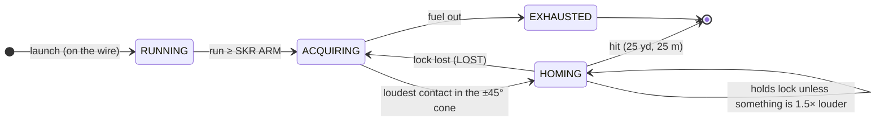

- **Wire guidance.** A wired fish steers toward its aim point until its seeker takes over. The wire parts above
  12 kt of own speed or past 4,000 m of run, leaving the last stretch to the seeker.
- **TMA auto-solve.** Bearings-only TMA is ill-conditioned, so the solver searches rather than iterating: course
  (72 × 5°) × speed (21 × 1 kt) × present range (23 steps along the latest bearing) gives **34,776 hypotheses**,
  each back-propagated through the own-ship track and scored by mean bearing error in a single NumPy broadcast.
  Measured ranges (echoes, stadimeter) are folded in as a penalty. When near-equal fits disagree on course by
  more than 40°, the solver reports **AMBIGUOUS: NEW LEG**.

  <p align="center">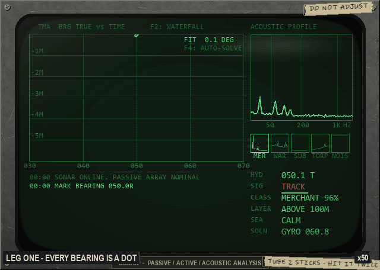<br>
  <sub><b>Target motion analysis.</b> A wrong course and speed peel the TDC's curve off your bearings; a second leg and a ping let auto-solve put it back.</sub></p>
</details>

<details>
<summary><b>🚢 Ship behaviour</b></summary>

Lookouts roll real per-second spotting chances, and a sighting puts a signal lamp on the target's bridge that you
can see through the scope. A sinking within 6 km scatters a convoy.

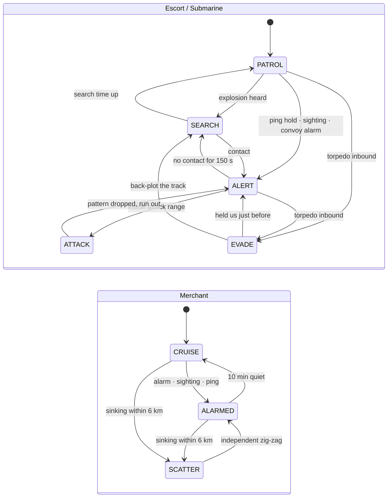

<p align="center">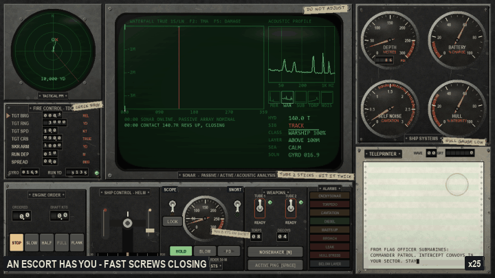<br>
<sub><b>Caught.</b> Fast screws, the enemy sonar lamp, a pattern rolled overhead, and the damage party's list.</sub></p>

Escorts drop five-charge patterns at a guessed depth and search in an expanding square. When they hear a
torpedo with no fresh contact, they back-plot its track (with error growing along the run) to find where you
fired from. Enemy submarines stalk you, fire homing fish and drop decoys. The **wave director** escalates each
convoy and its screen, and in the campaign it starts several waves' worth of escalation ahead.
</details>

<details>
<summary><b>🖥 Rendering</b>: vector CRTs, a 1970s control room, a periscope</summary>

- **CRT pipeline** (`graphics/crt_renderer.py`): vector drawing, then phosphor ghosting (the previous frame
  `BLEND_RGB_MAX`'d in and decayed), then a green tint, then scanlines, then a vignette. The ghost is taken
  *before* the tint, so the tint doesn't pile up to `tint / (1 − decay)`.
- **Control-room art kit** (`graphics/console_art.py`): hammertone steel with grime, bevels, wear and screws,
  engraved legends that fade, Dymo and masking-tape labels, gauge faces with glinting needles, mechanical drum
  counters, guarded toggles, backlit buttons and annunciator tiles. It is all procedural.
- **Periscope** (`graphics/periscope.py`): a pre-rendered sky panorama, the sea at one-third resolution with
  ripple texture, ship silhouettes by class (with smoke, bow waves and wakes, settling by the stern when sunk),
  burst columns, and lens effects. It runs in about 9 ms a frame.

  <p align="center">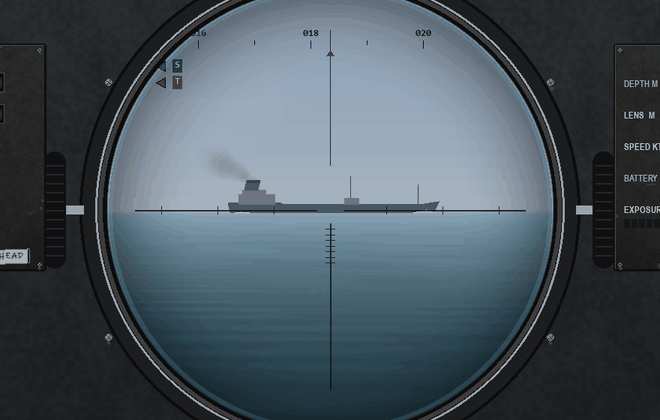</p>
- **Accessibility:** large teleprinter text, and colour-blind lamps that use the Okabe–Ito palette.
</details>

<details>
<summary><b>🎧 Audio</b>: synthesised at start-up, about 0.3 s</summary>

- Pings are exponential frequency sweeps with a 4 ms attack. The enemy's ASDIC is a flat, steady tone. The
  explosion is a 40 → 15 Hz sub-bass sweep over low-passed noise. Hull creaks are ring-modulated square waves
  whose pitch sags. The diesel is 25 Hz firing pulses in seamless whole-cycle loops.
- **Stereo by bearing.** Echoes, enemy pings, detonations and countermeasures are panned by relative bearing. The
  hydrophone loop pans to wherever the dial points.
- **Hull reverb.** Interior sounds are FFT-convolved with a synthetic steel-hull impulse response (ringing modes at
  96, 151, 233 and 347 Hz over a diffuse tail). The diesel loop uses *circular* convolution, so its tail wraps and
  the loop stays seamless.
- **Mix by category.** Every buffer is RMS-normalised to its category (sonar, effects, ambience) and peak-limited,
  so the settings sliders mix like with like.
</details>

<details>
<summary><b>💾 Persistence</b></summary>

| File | Holds |
|---|---|
| `~/.silent_solution/settings.json` | volumes, key bindings, mouse sensitivity, large text, colour-blind lamps |
| `~/.silent_solution/career.json` | campaign progress, refits, patrol log, top-ten high scores |
| `~/.silent_solution/crash.log` | timestamped tracebacks with the version |

Missing or corrupt files fall back to defaults, and a read-only home folder just means nothing persists between
runs.
</details>

## 🧰 Development

```bash
uv run checks.py                          # every suite headless (SDL dummy drivers), then ruff; CI runs it too
uv run --with pillow docs/shots.py        # regenerate the README screenshots from live game states
uv run --with pillow docs/gifs.py         # film the README GIFs (scripted runs, time-lapse, Dymo captions)
uv run --with pyinstaller build.py        # dist/SilentSolution.exe
```

| Suite | Covers |
|---|---|
| `test_sim.py` | engagements, escort hunts and counter-fire, masts, spotting, optics, convoys and scatter, TMA auto-solve, damage control, spreads and wire guidance, campaign waves |
| `test_geometry.py` | the positional backbone: sonar, echoes, periscope, eyepiece image, TDC position keeping and TMA all agree with the geometry core in 3D through a turn; LOCK and scope-to-sonar put the ship in the eyepiece; bearing stabilisation and the waterfall's true/relative frames |
| `test_tutorial.py` | a scripted trainee plays the whole training patrol on three seeds, then each chapter on its own, then a run that skips every drill |
| `test_periscope.py` | the eyepiece renderer: ships on the horizon, nothing astern, a wave over the lens, frame time |
| `test_ui.py` | the real game loop, scripted: sail, quit, then open the replay from the list, the career log and the last patrol; an unreadable file is refused |
| `settings.py` · `audio.py` · `campaign.py` · `replay.py` · `graphics/tabletop.py` | self-checks: save round trips, key rebinding, the pan law, reverb loops, objectives, refits and patrol outcomes, replay round trips and retention, recording never moves the world, projection conventions and close-up clipping |

<details>
<summary><b>Project layout</b></summary>

```text
SilentSolution/
├── main.py              game loop, screen states, crash log
├── geometry.py          the 3D positional backbone: bearings, ranges, angles, rates
├── sim.py               WORLD: vessels, torpedoes, ocean and weather, masts, damage, world step
├── ai.py                WORLD: merchants, escorts, submarines, convoys, wave director
├── tuning.py            every balance knob and difficulty preset in one place
├── sensors.py           passive and active sonar, periscope optics
├── fire_control.py      Torpedo Data Computer
├── tma.py               bearing history, fit and auto-solve
├── displays.py          waterfall, acoustic profiler, teleprinter
├── console.py           operator state, input, event reports
├── workstation.py       draws the station, CRT pages and periscope eyepiece
├── layout.py            1280×720 logical geometry, shared by input and drawing
├── audio.py             procedural NumPy synthesis, pan, hull reverb
├── settings.py          settings page and persistence
├── campaign.py          patrols, debriefs, ranks, refits, career and high scores
├── tutorial.py          the training patrol, in chapters
├── replay.py            WORLD (read-only): the after-action recorder, saved replays
├── graphics/
│   ├── crt_renderer.py  vector CRT and post-processing
│   ├── console_art.py   procedural 1970s/80s control-room art kit
│   ├── periscope.py     the view through the eyepiece
│   └── tabletop.py      the after-action plotting table
├── docs/shots.py        README image generator
├── docs/gifs.py         README GIF filming
├── build.py             PyInstaller one-file build
└── checks.py            runs every suite
```
</details>

> [!IMPORTANT]
> Two rules hold the codebase together. **The world never draws, and the operator never reads the truth**: if
> it isn't in a sensor reading or a world event, the console doesn't know it. And **every kinematic update uses
> `dt`**, so the simulation behaves the same at any frame rate and in the headless tests.

---

<div align="center">

**Silent Solution** · v0.2.2 · by Jacob Frusher · built with [pygame-ce](https://pyga.me/) and [NumPy](https://numpy.org/) ·
[MIT licence](LICENSE) ([third-party notices](THIRD-PARTY-NOTICES.txt))

<sub>Run silent, run deep.</sub>

</div>
