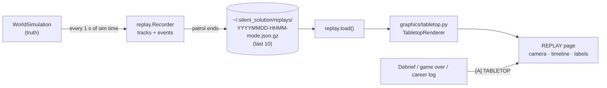

# Plan: 2.5D tabletop replay

After every patrol the player can open a **plotting-table replay**: the whole engagement in true 3D, seen at an
angle across a wardroom chart table, with the ships as painted models on the paper, the submarines hanging
below on depth stalks, and the thermocline as a smoked-glass sheet. It shows the truth they couldn't see while
playing.

## Decisions (from the Q&A)

| Question | Decision |
|---|---|
| Style | **Plotting table**: paper chart, wooden rails, painted models, a smoked-glass layer. In keeping with the vintage station. |
| Camera | **Free orbit** (drag), zoom (wheel), pan (right-drag), plus one-key presets: plan, side (depth profile), oblique, follow own boat |
| Layers | **Truth in 3D**: every hull's true track with depth stalks, torpedo runs and wire paths, charge patterns sinking and bursting, noisemakers, sinkings. ("Your picture vs truth", detection lines and envelopes are left for later.) |
| Where | **Every patrol** (campaign, endless, training), recorded and saved. Opened from the debrief, the game-over screen and the career log. The last 10 are kept on disk. |

## What it rests on

The geometry core (`geometry.py`) and its cross-check suite (`test_geometry.py`) already guarantee that the world
state is consistent in 3D. The recorder stores **world truth** (`sim.py` state), never operator estimates, so the
replay is exactly as accurate as the simulation.

## Architecture

### 1. Recorder (`replay.py`, world side, read-only)
- Every body gets a stable integer `uid` when it enters the world (`WorldSimulation` hands them out), so tracks
  survive list removal and reordering. `id()` is not stable across a save and load.
- Every **1.0 s of sim time** (a tuning value), sample each live body: `t, uid, x, y, z, heading, speed`. Torpedoes
  also record `wired`, `wire_aim` and `state`.
- On first sight, record each body's **static description**: `kind`, class (merchant / tanker / escort / sub /
  own / torpedo / decoy / charge), `hostile`, `tube`, name (once ship names exist), spawn time.
- **Events**, stamped with sim time and the bodies involved: launch, hit, sinking (`sunk_at`), charge pattern
  dropped, charge detonation (position and depth), noisemaker dropped, wire cut, own boat damaged, own boat lost,
  wave start and clear. These give the timeline its ticks.
- **Hooks:** `Console.update` calls `recorder.sample(world)` after `world.step`, and the recorder also reads
  `frame_events`. Recording never changes the world, and a test enforces that.
- **Budget:** a 60-minute patrol with about 25 bodies is roughly 90k samples. Positions rounded to 0.1 m and
  headings to 0.1° come to about 1.5 MB as gzipped JSON. Long endless runs are capped by thinning samples older
  than 30 min to 4 s.

### 2. File format and storage
- `~/.silent_solution/replays/<stamp>-<mode>.json.gz`:
  - `version`, `meta` (mode, patrol name, result, GRT, duration, seed, game version, layer depth, sea state over time)
  - `bodies` (static descriptions)
  - `tracks` (per uid: column arrays `t, x, y, z, h, v`)
  - `events`
- Only the 10 newest are kept. The career log entry stores the replay's filename, so the log links to it.
- Corrupt or old-version files are listed but greyed out with "can't play"; the game never crashes on them.

### 3. Tabletop renderer (`graphics/tabletop.py`)
- **Projection:** a perspective camera orbiting a look-at point.
  - Parameters: yaw, pitch (10–90°), distance and a field of view.
  - World to camera to screen is computed with NumPy for all vertices at once, ordered back to front with the
    painter's algorithm (no z-buffer needed for models this simple).
- **Depth exaggeration:** the sea is about 10 km across and the action is 0–300 m deep, so true scale makes depth
  invisible. Vertical scale defaults to ×10, adjustable (×1 to ×25), and labelled on the depth scale so it's
  never misleading.
- **The table:**
  - Wooden rails around the chart area. Chart paper with a 1 nm grid, a compass rose and range rings around own
    boat's position at the selected time.
  - The surface is the paper plane, z = 0.
  - The thermocline is a translucent smoked-glass sheet at the patrol's layer depth (exaggerated), with a depth
    scale (0 / 100 / 200 / 300 m) on the rail.
- **Models:** low-poly extruded prisms by class, painted in the art kit's palette:
  - merchant (grey hull, buff upperworks), tanker (long, low, aft bridge), escort (dark grey, raked)
  - own boat (blue-grey) and enemy sub (red-brown), both cigar hulls with a sail
  - torpedo (brass dart), charge (black drum), noisemaker (white puff)

  Submerged models get a **depth stalk**: a thin line from the paper straight down, with a shadow dot on the paper.
- **Tracks:** the true track of every body as a fading polyline (the last N minutes, or the whole patrol). Submerged
  tracks are drawn at depth and their shadows on the paper. Torpedo runs are dotted at run depth, and wire paths are
  a thin line back to the launch point while wired.
- **Effects:**
  - charge patterns sink as falling drums, with a burst ring at detonation depth
  - sinkings tilt and settle the model below the paper over `WRECK_TIME`
  - hits flash a ring on the paper
- **Hover labels:** class, name, depth, speed, course and AI state at that moment, drawn as a tape label in the
  station's style.

### 4. REPLAY page (`main.py` state + `workstation.py` drawing)
- Full screen, framed by the station's bezel with a brass placard "AFTER-ACTION PLOT".
- **Camera:**

  | Input | Action |
  |---|---|
  | drag | orbit |
  | wheel | zoom |
  | right-drag | pan |
  | <kbd>1</kbd> | plan (top-down, north up) |
  | <kbd>2</kbd> | side (depth profile along the own boat's track) |
  | <kbd>3</kbd> | oblique |
  | <kbd>4</kbd> | follow own boat |
  | <kbd>0</kbd> | reset |
  | <kbd>[</kbd> <kbd>]</kbd> | depth exaggeration |

- **Time:**

  | Input | Action |
  |---|---|
  | <kbd>Space</kbd> | play / pause |
  | <kbd>←</kbd> <kbd>→</kbd> | step 10 s |
  | <kbd>Shift</kbd>+<kbd>←</kbd> <kbd>→</kbd> | jump to the previous / next event |
  | <kbd>+</kbd> <kbd>−</kbd> | speed (1× / 4× / 16× / 60×) |
  | click or drag the timeline | scrub |

  The timeline shows event ticks with icons: launch, hit, sinking, pattern, damage.
- Playback interpolates linearly between samples (headings by shortest arc), so motion is smooth at any speed.
- **Entry points:** **[A] TABLETOP** on the debrief and endless game-over screens, a replay icon on each career log
  line, and at the end of training. <kbd>Esc</kbd> returns to where it was opened from.

## Phases (each a `feature/*` branch, with tests and screenshots)

1. **Recorder and storage:** uids, sampling, events, gzip save/load, retention, career-log link.
   *Tests:* a round trip reproduces positions within rounding; the recorder doesn't change the world (world hash
   with and without it); thinning; corrupt files are handled.
2. **Projection and table:** camera maths and presets, chart, rails, grid, layer sheet, depth scale.
   *Tests:* plan view maps north to up and east to right; side view maps depth downward at the chosen exaggeration;
   orbit keeps the look-at point centred.
3. **Models, tracks and effects:** class models, stalks and shadows, tracks, torpedo and wire paths, charges,
   sinkings.
   *Tests:* a headless render of each preset with no exceptions; frame time under 16 ms with 30 bodies.
4. **REPLAY page and timeline:** controls, scrubbing, event jumps, hover labels, entry points.
   *Tests:* scripted UI drive (the same approach as the main-loop smoke test).
5. **Polish:**
   - README gallery shot and GIF
   - a training mention
   - a performance pass

## Left for later (chosen against for now)

- **Your picture against the truth:** a TDC ghost, sonar bearing lines, marks and echo fixes.
- **Who detected whom:** ping rings, held and spotted lines, first-detection markers.
- **Sound and sight envelopes:** lookout circles, sonar reach, the layer's shadow.

The recorder already captures enough to add these later, except the operator layers, which would need the
console's TDC, dial and marks recorded alongside. Leaving room in the file format for an `operator` section costs
nothing now.
